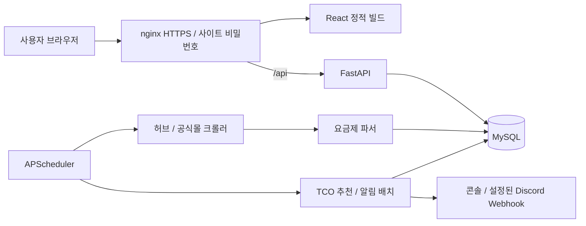

# 알뜰알뜰 — MVNO TCO 요금제 추천과 환승 알림

알뜰폰 사용자가 원하는 환승 주기 안에서 총 통신비가 가장 낮은 요금제를 찾고, 선택한 유지기간 종료 전에 대체 요금제를 확인할 수 있는 캡스톤 프로젝트입니다. 월 할인 가격뿐 아니라 할인 종료 후 정상 요금까지 합산한 **TCO(Total Cost of Ownership, 총소유비용)**를 비교합니다.

## 구현 기능

- **한국어·영어**: 상단 언어 선택, 브라우저에 선택 저장, 기기별 FCM 알림 언어 적용. 요금제·통신사 이름은 원문을 유지하고 금액은 KRW로 표시합니다.

- **TCO 랭킹**: 6·12·24·36·48개월 환승 주기 선택, 기본 12개월, 총비용과 월평균 비용 표시
- **상세 필터**: 최소 QoS 속도, 음성통화 무제한, 문자 무제한, LTE/5G 선택
- **요금제 카드**: 기본·일일 데이터, 소진 후 속도, 통화·문자 제공량, 월 할인가, 정상가, 할인 기간 표시
- **Google 로그인**: Firebase ID 토큰 검증, 계정별 구독 접근 제한, 기존 이메일 계정의 구독 연결
- **개통 등록·삭제**: 개통일과 이용 주기 저장, 내 요금제와 관련 알림 삭제, 유지기간 종료 한 달 전·일주일 전·하루 전 알림 예약
- **추천 알림**: 유지기간 종료 한 달 전부터 이용 중인 요금제와 유사한 데이터·QoS 조건의 TCO 최저가 대체 상품 표시
- **크롤링**: 알뜰폰허브와 사업자 공식몰 수집, 데이터·QoS·통화·문자 정형화 및 MySQL 적재
- **정기 작업**: 한국 시간 기준 매일 02:00 수집, 00:00 환승 알림 배치
- **도메인 배포**: 기존 nginx 서비스와 분리한 사이트 설정, HTTPS, Google 사용자 인증, 인증서 자동 갱신

QoS 필터는 **해당 속도 이상**을 의미합니다. 예를 들어 5Mbps 선택 시 10Mbps 상품도 포함됩니다.

## 기술 구성

| 영역 | 기술 |
| --- | --- |
| 프론트엔드 | React 19, Vite, Tailwind CSS, Lucide |
| API | FastAPI, Pydantic, SQLAlchemy |
| 데이터베이스 | MySQL 8 |
| 수집·파싱 | Requests, BeautifulSoup, 정규표현식, Unicode 정규화 |
| 스케줄러 | APScheduler |
| 실행·배포 | Docker Compose, nginx, Certbot, systemd |



## TCO 계산

이용 기간을 `T`, 할인 기간을 `D`, 월 할인가를 `P`, 정상 월요금을 `N`이라 하면:

```text
일반 할인: TCO = P × min(T, D) + N × max(T - D, 0)
평생 할인(D = -1): TCO = P × T
월평균 비용 = round(TCO / T)
```

예를 들어 7개월간 월 0원, 이후 월 22,000원인 상품은 6개월 TCO가 0원이고 12개월 TCO는 110,000원입니다. 정상가가 확인된 실제 0원 프로모션은 유지합니다.

동일 TCO에서는 무제한 여부, QoS 속도, 일일 데이터, 기본 데이터 순으로 조건을 비교합니다. 가입비·유심비·위약금·결합 조건 등은 현재 TCO에 포함하지 않습니다.

## 환승 알림 기준

알림과 추천 표시 기준은 할인 종료일이 아닌 **개통일 + 선택한 유지기간**입니다.
한 달 전은 고정 30일이 아닌 달력 기준으로 계산하며, 해당 월에 같은 날짜가 없으면 월말을 사용합니다.
추천은 유지기간 종료 한 달 전부터 표시하고, 발송 시점에 최신 상품을 비교합니다.
할인 종료일은 가격 변동 안내를 위해 별도로 표시합니다.

기존 DB를 업그레이드할 때는 알림 enum 확장과 대기 알림 일정 변경이 필요합니다.
발송 이력은 보존하며 새 기준보다 이른 추천 연결은 해제합니다.

```bash
# 적용 전 변경 건수 미리보기
docker exec alddle_backend python -B -m deploy.migrate_notification_schedule
# 알림 백업 후 적용 (백업은 컨테이너 /tmp에 생성)
docker exec alddle_backend python -B -m deploy.migrate_notification_schedule --apply
docker restart alddle_backend
```

## 수집 데이터 검증과 보정

다음 오류를 방지하는 코드와 회귀 테스트를 추가했습니다.

- 가격 누락을 무료 상품으로 처리하는 문제: 가격 요소가 없거나 정상가가 확인되지 않은 항목 제외
- 검색 메뉴·혜택·로밍 안내 오수집: 범용 수집을 알려진 상품 카드와 가격 요소로 제한
- 과거 범용 수집 데이터: 원문에 검증 근거가 없는 항목은 재수집 전까지 추천에서 제외
- 종량제 단가의 월요금 오인: 사용량 없이 고정 TCO를 계산할 수 없는 상품 제외
- 평생 할인 `-1`의 계산 오류: 전체 이용 기간에 할인가 적용
- `+300MB`를 `300Mbps`로 읽는 오류: 데이터 용량과 속도 단위를 분리
- 요금제명·혜택 문구보다 명시적인 데이터 스펙 필드를 우선하여 파싱

수집 시 구독 중인 기존 상품은 비활성 상태로 보존하고, 구독되지 않은 기존 상품은 삭제한 뒤 새 데이터를 적재합니다. 기존 추천 알림의 상품 참조도 해제됩니다. 수동 재수집은 현재 데이터와 알림 이력에 영향을 주므로 운영 데이터 백업 후 실행하세요. 사이트 구조 변경이나 수집 실패에 대한 추가 보강은 계속 필요합니다.

## 로컬 실행

필요 환경: Docker 및 Docker Compose, Node.js(Vite 8이 지원하는 버전), npm.

```bash
git clone https://github.com/leethejun/capstone_MVNO_TCO.git
cd capstone_MVNO_TCO
cp .env.example .env
```

`.env`의 MySQL 비밀번호와 `DATABASE_URL`을 같은 값으로 설정합니다. Docker 내부 DB 호스트는 `db`입니다. `.env`는 Git 및 Docker 빌드 컨텍스트에서 제외됩니다.

```bash
# MySQL과 FastAPI 실행
docker compose up -d --build

# 프론트엔드 개발 서버
cd frontend
npm ci
npm run dev
```

- 프론트엔드: `http://127.0.0.1:5173`
- API 문서: `http://127.0.0.1:8000/docs`
- DB 연결 확인: `http://127.0.0.1:8000/health/db`

프론트엔드의 기본 API 주소는 `/api`입니다. 개발에서는 Vite proxy, 운영에서는 nginx가 FastAPI로 전달합니다. 필요한 경우 `frontend/.env.example`을 참고해 `VITE_API_BASE_URL`을 지정합니다.

초기 DB는 수집 또는 개발용 시드로 채울 수 있습니다. 아래 수집 명령은 상품 데이터를 갱신하므로 운영 중에는 주의해서 사용하세요.

```bash
# 소규모 허브 수집, 공식몰 수집 제외
curl -X POST 'http://127.0.0.1:8000/api/crawler/run?max_pages=1&include_direct=false'
```

## 주요 API

| 메서드 | 경로 | 기능 |
| --- | --- | --- |
| GET | `/api/plans/rank` | 이용 기간·필터별 TCO 랭킹 |
| GET | `/api/plans/telecoms` | 통신사 목록 |
| GET | `/api/plans/{plan_id}` | 상품 상세 |
| GET/PATCH | `/api/users/me` | 인증 계정 조회·이용 주기 변경 |
| POST/DELETE | `/api/push/devices` | 로그인 계정의 알림 기기 등록·해제 |
| POST | `/api/push/test` | 본인 기기로 테스트 푸시 발송 |
| GET | `/api/users/{user_id}` | 계정 조회 |
| POST | `/api/subscriptions` | 개통 등록 및 알림 예약 |
| GET | `/api/subscriptions/user/{user_id}` | 계정별 구독·알림 조회 |
| DELETE | `/api/subscriptions/{subscription_id}?user_id=...` | 내 요금제와 관련 알림 삭제 |
| GET | `/api/crawler/status` | 수집 상태 |
| POST | `/api/crawler/run` | 상품 재수집 |
| POST | `/api/crawler/sync-telecoms` | 통신사 마스터 동기화 |
| GET | `/api/notifications/pending` | 발송 대기 알림 |
| POST | `/api/notifications/trigger-batch` | 알림 배치 수동 실행 |
| GET | `/api/notifications/scheduler/jobs` | 정기 작업 상태 |

## nginx 배포

배포 대상은 `alddletco.bulldog-walker.com`입니다. 호스트 nginx가 React 빌드 파일을 제공하고 `/api/`를 로컬 FastAPI로 전달합니다. 기존 블로그·댓글·Open WebUI 설정을 덮어쓰지 않습니다.

```bash
npm run build --prefix frontend
sudo bash deploy/install-host.sh
```

최초 배포는 DNS 등록 후 실행합니다. 이 도메인 전용 systemd 타이머로 인증서 갱신을 관리합니다.

프론트엔드 수정 후에는:

```bash
npm run build --prefix frontend
sudo bash deploy/update-frontend.sh
```

백엔드 수정 후에는 DB를 재생성하지 않고 해당 서비스만 반영합니다.

```bash
docker compose up -d --no-deps --build backend
```

전체 절차, DNS, 검증, 갱신 안내는 [배포 README](deploy/README.md)를 참고하세요.

## 검증

```bash
npm run build --prefix frontend
npm run lint --prefix frontend
node --test frontend/tests/i18n.test.js
docker exec alddle_backend python -B -m unittest discover -s tests -v
```

회귀 테스트는 데이터 용량/QoS 단위 구분, 할인 종료·평생 할인 TCO, 비정상 상품 제외, 실제 0원 프로모션 보존, 기존 이메일 계정 연결, 유지기간 알림 일정, 월말 추천 표시 경계, 요금제 삭제 등을 검증합니다. 현재 59개 테스트가 포함되어 있습니다. 프론트엔드 린트에는 기존 React Hook 및 렌더링 관련 경고가 남아 있습니다.

## 현재 구현 범위와 후속 과제

- 사용자 API는 Google 로그인 토큰을 검증하고 본인 데이터만 허용합니다. 크롤러 실행·알림 배치·스케줄러 조회는 `FIREBASE_ADMIN_UIDS`에 등록된 관리자만 접근할 수 있습니다.
- FCM Web Push와 서비스 워커의 백그라운드 알림을 구현했습니다. iOS는 지원 버전에서 홈 화면에 추가한 앱으로 사용해야 합니다. 오프라인 페이지 실행은 아직 지원하지 않습니다.
- Discord Webhook 전송 코드가 있으며 환경 설정이 필요합니다. 현재 Compose 파일에는 `DISCORD_WEBHOOK_URL` 전달 설정이 없으므로 사용 시 별도로 추가해야 합니다.
- FCM은 계정별 여러 기기를 지원하며 로그아웃 시 현재 기기 연결을 해제합니다. 실패는 최대 3회 배치에서 재시도하며, 성공한 기기에는 같은 알림을 재전송하지 않습니다. `SENT`는 FCM 접수 성공이며 실제 열람을 보장하지 않습니다.
- 평생 할인 상품의 개통 등록 만료일·알림 정책은 추가 보강이 필요합니다.
- 스케줄러가 API 프로세스 안에서 실행되므로 여러 worker/복제본을 운영할 때 중복 실행 방지가 필요합니다.
- 사이트별 수집 정확도, 수집 실패 시 기존 데이터 보존, 조건부 할인 검증을 개선할 예정입니다.

## 디렉터리

```text
frontend/             React 화면, API 연결, 개발·빌드 설정
routers/              FastAPI 엔드포인트
services/crawler/     허브·공식몰 수집과 적재 파이프라인
services/scheduler/   정기 크롤링·알림 작업
services/tco.py       비용 계산과 랭킹
services/recommender.py 대체 상품 추천
services/notifier.py  알림 메시지와 채널 처리
parser.py             비정형 상품 스펙 파서
models.py / schemas.py DB 모델과 API 스키마
tests/                회귀 테스트
deploy/               nginx·systemd 구성과 설치·업데이트 스크립트
```

## Firebase 설정과 기존 서비스 업데이트

1. Firebase 웹 앱 설정을 `frontend/.env.local`에 입력합니다 (`frontend/.env.example` 참고).
2. Google 로그인 제공자를 활성화하고 승인된 도메인에 `alddletco.bulldog-walker.com`을 등록합니다.
3. Cloud Messaging의 Web Push 공개 키를 `VITE_FIREBASE_VAPID_KEY`로 지정합니다.
4. 서버용 서비스 계정 JSON은 `secrets/service-account.json`에 저장하고 `.env`의 `FIREBASE_PROJECT_ID`를 지정합니다. 비공개 키는 Git과 Docker 이미지에 포함하지 않습니다.
5. `npm run build --prefix frontend` 후 `sudo bash deploy/update-firebase.sh`를 실행합니다. 기존 계정·구독을 보존하는 DB 변경, 백엔드 교체, 이 앱의 nginx 설정과 프론트엔드 반영을 수행합니다.
6. 사이트에서 Google 로그인 → 알림 탭 → 푸시 알림 켜기 → 테스트 알림 보내기로 수신을 확인합니다.

사이트는 접속 비밀번호 없이 열립니다. Firebase ID 토큰은 `X-Firebase-ID-Token` 헤더로 전달하며, 사용자 API는 Google 로그인과 계정별 권한 검사로 보호합니다. 기존 Basic 인증 제거는 `sudo bash deploy/remove-basic-auth.sh`로 반영합니다.

언어 기능 업데이트는 프론트엔드 빌드 후 `sudo bash deploy/update-firebase.sh`로 반영합니다. 기기 언어 컬럼을 기존 데이터 보존 방식으로 추가하고 백엔드를 다시 실행합니다. 기존 기기는 한국어가 기본이며 앱에서 언어를 바꾸면 푸시 등록 정보도 갱신합니다.

KG모바일은 JavaScript 렌더링 페이지 대신 사이트의 공개 상품 API를 수집합니다. 게시된 그룹과 현재 가입 가능한 상품만 읽고, 평생 할인액과 기간 할인액을 구분합니다. 쿠폰·카드 혜택은 TCO에서 차감하지 않습니다. KG API 장애 시 일일 수집에서 기존 KG 상품을 보존합니다. KG만 갱신하려면 `docker exec alddle_backend python -B -m deploy.refresh_kgmobile`을 실행하세요. 다른 통신사와 가입 당시 상품 정보는 유지합니다.


### 통신사 수집 범위 및 장애 확인

공식몰 수집 대상은 알뜰폰허브 브랜드 목록과 `MASTER_TELECOMS`의 합집합입니다.
허브에서 빠진 사업자도 방문하며, 같은 공식몰 도메인은 하나의 대상으로 합칩니다.
마스터는 수동 관리 목록이며 나무위키를 실시간으로 크롤링하지 않습니다.
새 사업자는 마스터에 이름·공식 URL·망 정보를 추가하면 다음 실행부터 포함됩니다.

관리자 인증으로 `GET /api/crawler/coverage`를 호출하면 마지막 실행의 통신사별
공식몰 수집 수, 허브 브랜드관 수집 수, 실패 상태 및 사유를 확인할 수 있습니다.
보고서는 `runtime/crawler-report.json`에 저장되고 Git에서 제외됩니다.
`needs_attention`은 상품이 없다는 뜻이 아니라 공식몰 수집기 검증이 필요하다는 뜻입니다.
허브 상품이 수집되어도 공식몰 실패 상태를 감추지 않습니다.

매일 새벽 수집은 전체 상품을 먼저 수집·검증한 후 하나의 DB 트랜잭션으로
추천 목록을 교체합니다. 구독에 연결된 이전 상품은 가입 당시 조건을 보존한 채
비활성화하고, 나머지 이전 상품은 삭제합니다. 삭제되는 상품을 참조한 과거 알림은
추천 상품 참조만 해제하며 알림 자체는 유지합니다. 현재 수집 결과에 없는 기존
상품은 추천에 남기지 않으므로, 일부 통신사 수집 실패 시 그 통신사의 과거 상품은
추천에서 제외됩니다. 다른 판매 채널의 상품은 별개로 유지합니다.

허브 전체 수집 미완료, 페이지 수 제한 실행, 전체 빈 결과 또는 전체 검증 실패 시
추천 목록을 교체하지 않습니다. DB 교체 중 오류는 롤백하므로 기존 목록과 구독
이력이 유지됩니다. 실패와 통신사별 확인 필요 상태는 수집 보고서에서 확인합니다.
일반 HTML 파서로 읽지 못하는 공식몰에는 사이트별 전용 수집기 보강이 필요합니다.
